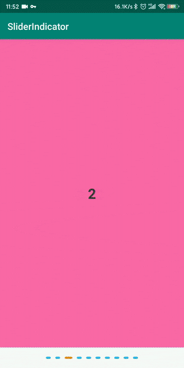

[中文](README_CN.md)

[licensesvg]: https://img.shields.io/badge/License-Apache--2.0-brightgreen.svg
[license]: https://github.com/dakun666/SliderIndicator/blob/master/LICENSE

## Introduce
Indicator for Android Viewpager, with slide and gradient animation, smooth and lightweight

## Example



## Dependency

* Gradle 
```
implementation 'cn.nightcoder:sliderindicator:1.0.1'
```

## How to use

```
<cn.nightcode.sliderIndicator.SliderIndicator
        android:id="@+id/slide_indicator"
        android:layout_width="wrap_content"
        android:layout_height="wrap_content"
        android:layout_marginTop="20dp"
        android:layout_marginBottom="20dp"
        app:diaDimension="4dp"
        app:isAnimation="true"
        app:isShadow="false"
        app:selectedIndicatorColor="#f57c00"
        app:selectedWidthDimension="16dp"
        app:spaceDimension="10dp"
        app:unselectedIndicatorColor="#03a9f4"
        app:unselectedWidthDimension="10dp" />
```

```
indicator.setupWithViewPager(viewPager);
```
##### Note：setupWithViewPager() must be called after adapter determines the length.

## Parameters

Parameter | Note
  --- | ---
selectedIndicatorColor | Selected indicator color
unselectedIndicatorColor | Unselected indicators color
selectedWidthDimension | Selected indicator width
unselectedWidthDimension | Unselected indicators width
diaDimension | Indicators height
spaceDimension | Distance between indicators
isAnimation | Need Animation
isShadow | Is the Indicators shaded
shadowColor | Indicators shadow color
shadowRadiusDimension | Indicators shadow radius

## License 
[![License][licensesvg]][license]
```
Copyright 2019 dakun(https://github.com/dakun666/SliderIndicator)

Licensed under the Apache License, Version 2.0 (the "License");
you may not use this file except in compliance with the License.
You may obtain a copy of the License at

    http://www.apache.org/licenses/LICENSE-2.0

Unless required by applicable law or agreed to in writing, software
distributed under the License is distributed on an "AS IS" BASIS,
WITHOUT WARRANTIES OR CONDITIONS OF ANY KIND, either express or implied.
See the License for the specific language governing permissions and
limitations under the License.
```