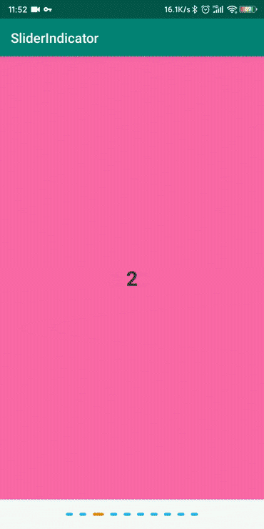

[English](README.md)

[licensesvg]: https://img.shields.io/badge/License-Apache--2.0-brightgreen.svg
[license]: https://github.com/dakun666/SliderIndicator/blob/master/LICENSE

## SliderIndicator 介绍 
用于安卓ViewPager的indicator, 带有滑动和渐变动画，顺滑且轻量级

## 效果



## 引入

* Gradle 
```
implementation 'cn.nightcoder:sliderindicator:1.0.3'
```

## 使用

```
<cn.nightcode.sliderIndicator.SliderIndicator
        android:id="@+id/slide_indicator"
        android:layout_width="wrap_content"
        android:layout_height="wrap_content"
        android:layout_marginTop="20dp"
        android:layout_marginBottom="20dp"
        app:diaDimension="4dp"
        app:isAnimation="true"
        app:isShadow="false"
        app:selectedIndicatorColor="#f57c00"
        app:selectedWidthDimension="16dp"
        app:spaceDimension="10dp"
        app:unselectedIndicatorColor="#03a9f4"
        app:unselectedWidthDimension="10dp" />
```

```
indicator.setupWithViewPager(viewPager);
```
##### 注意：setupWithViewPager() 需要在adapter确定长度后调用

## 参数说明

参数 | 说明
  --- | ---
selectedIndicatorColor | 选中状态指示器颜色
unselectedIndicatorColor | 未选中状态指示器颜色
selectedWidthDimension | 选中状态指示器宽度
unselectedWidthDimension | 未选中状态指示器宽度
diaDimension | 指示器高度
spaceDimension | 指示器之间的间距
isAnimation | 是否设置动画效果
isShadow | 指示器是否需要阴影
shadowColor | 指示器阴影颜色
shadowRadiusDimension | 指示器阴影长度

## License 
[![License][licensesvg]][license]
```
Copyright 2019 dakun(https://github.com/dakun666/SliderIndicator)

Licensed under the Apache License, Version 2.0 (the "License");
you may not use this file except in compliance with the License.
You may obtain a copy of the License at

    http://www.apache.org/licenses/LICENSE-2.0

Unless required by applicable law or agreed to in writing, software
distributed under the License is distributed on an "AS IS" BASIS,
WITHOUT WARRANTIES OR CONDITIONS OF ANY KIND, either express or implied.
See the License for the specific language governing permissions and
limitations under the License.
```